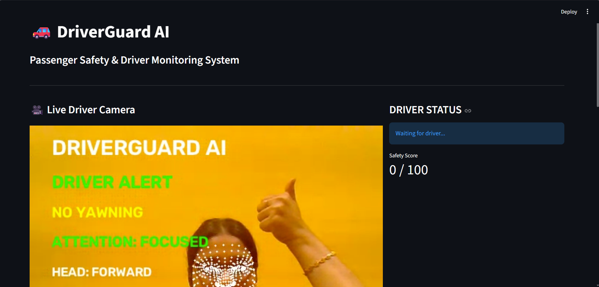
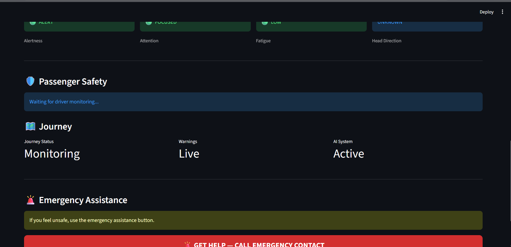

# 🚗 DriverGuard AI

### Real-Time Driver Drowsiness, Distraction & Safety Monitoring System

DriverGuard AI is an AI-powered driver monitoring system designed to detect
drowsiness, yawning, distraction, and changes in head direction in real time.

The system uses computer vision and facial landmark analysis to continuously
monitor the driver's condition, calculate a **Driver Safety Score**, and
present the results through an interactive Streamlit dashboard.

---

## 📸 Dashboard Preview

<p align="center">
  
</p>

<p align="center">
  
</p>

---

# ✨ Features

- 👁️ Real-time driver face monitoring
- 😴 Drowsiness detection
- 🥱 Yawning detection
- 👀 Distraction detection
- 🧭 Head-direction monitoring
- 📊 Dynamic Driver Safety Score
- 🚦 Safe / Caution / High Risk assessment
- 🚨 Emergency assistance interface
- 🌐 Interactive Streamlit dashboard
- 📷 Real-time webcam processing
- 🤖 MediaPipe facial landmark detection

---

# 🧠 How DriverGuard AI Works

DriverGuard AI continuously analyzes the driver's face using computer vision
and facial landmarks.

The system extracts multiple behavioral indicators and combines them to
estimate the driver's current condition.

```text
Camera Input
     │
     ▼
Face Detection
     │
     ▼
Facial Landmark Extraction
     │
     ├───────────────┬────────────────┐
     ▼               ▼                ▼
Eye Analysis    Mouth Analysis   Head Analysis
    │                │                │
    ▼                ▼                ▼
Drowsiness         Yawning        Distraction
Detection         Detection       Detection
     │               │                │
     └───────────────┴────────────────┘
                     │
                     ▼
            Driver Monitoring Engine
                     │
                     ▼
              Safety Score
                     │
                     ▼
             Risk Assessment
                     │
                     ▼
           Streamlit Dashboard
```

---

# 😴 Drowsiness Detection

The system uses the **Eye Aspect Ratio (EAR)** to estimate whether the
driver's eyes remain closed for an extended period.

The system identifies different levels of driver alertness:

- `DRIVER ALERT`
- `GETTING DROWSY`
- `CRITICAL DROWSINESS`

Sustained eye closure increases the detected drowsiness level.

---

# 🥱 Yawning Detection

DriverGuard AI analyzes mouth opening using facial landmarks.

A sustained increase in the mouth opening ratio is used to identify
possible yawning.

The dashboard displays:

- `NO YAWNING`
- `YAWNING DETECTED`

---

# 👀 Distraction Detection

DriverGuard AI estimates the driver's head direction using facial landmarks.

The system monitors:

- Looking Left
- Looking Right
- Looking Down
- Looking Up
- Forward

Prolonged deviation from the forward direction can trigger distraction
warnings.

The system distinguishes between increasing distraction and more severe
distraction conditions.

---

# 📊 Driver Safety Score

Multiple driver-monitoring indicators are combined into a single
**Driver Safety Score** ranging from:

```text
0 – 100
```

The score is used to represent the driver's current condition as:

- 🟢 **Safe**
- 🟡 **Caution**
- 🔴 **High Risk**

The score changes according to detected conditions such as drowsiness,
yawning, and distraction.

---

# 🌐 Interactive Dashboard

DriverGuard AI uses **Streamlit** to provide a passenger-friendly web
interface.

The dashboard contains:

- 📷 Live driver camera
- 👤 Driver condition
- 📊 Safety score
- 😴 Alertness status
- 👀 Attention status
- 🥱 Yawning status
- 🧭 Head direction
- 🛣️ Journey information
- 🚨 Emergency assistance

The goal is to present complex computer-vision results in a simple and
easy-to-understand interface for passengers.

---

# 🚨 Emergency Assistance

The dashboard includes a **GET HELP** interface that allows the passenger
to initiate contact with a predefined emergency contact when an unsafe
condition occurs.

The current prototype provides a phone-call interface.

Future versions can integrate backend-based communication services for
automatic:

- 📱 SMS notifications
- 📞 Voice calls
- 📍 Location sharing
- 🚨 Emergency alerts

---

# 🏗️ System Architecture

```text
                ┌───────────────────┐
                │   Camera Input    │
                └─────────┬─────────┘
                          │
                          ▼
                ┌───────────────────┐
                │ Face Detection &  │
                │ Facial Landmarks  │
                └─────────┬─────────┘
                          │
             ┌────────────┼────────────┐
             │            │            │
             ▼            ▼            ▼
        Eye Analysis   Mouth Analysis  Head Analysis
          (EAR)           (Yawning)     (Direction)
             │            │            │
             └────────────┼────────────┘
                          ▼
                ┌───────────────────┐
                │ Driver Monitoring │
                │      Engine       │
                └─────────┬─────────┘
                          │
                          ▼
                ┌───────────────────┐
                │ Safety Score &    │
                │ Risk Assessment   │
                └─────────┬─────────┘
                          │
                          ▼
                ┌───────────────────┐
                │ Streamlit Web     │
                │    Dashboard      │
                └─────────┬─────────┘
                          │
                ┌─────────┴─────────┐
                ▼                   ▼
          Driver Alerts       Emergency Help
```

---

# 🛠️ Technologies Used

| Technology | Purpose |
|---|---|
| Python | Core programming language |
| OpenCV | Real-time image and video processing |
| MediaPipe | Face detection and facial landmark extraction |
| NumPy | Numerical computation |
| Streamlit | Interactive web dashboard |
| Streamlit-WebRTC | Real-time webcam streaming |
| PyAV | Video frame processing |

---

# 📁 Project Structure

```text
DriverGuard-AI/
│
├── dashboard/
│   └── app.py
│
├── models/
│   └── face_landmarker.task
│
├── src/
│   ├── face_detector.py
│   ├── driver_monitor.py
│   ├── test_detector.py
│   └── test_monitor.py
│
├── screenshots/
│   ├── dashboard1.png
│   └── dashboard2.png
│
├── .gitignore
├── README.md
├── requirements.txt
└── baseline_drowsiness.py.py
```

---

# ⚙️ Installation

Follow the steps below to install and run DriverGuard AI locally.

## 1. Clone the Repository

Open **PowerShell** or a terminal and run:

```powershell
git clone https://github.com/Afrinnazir10/DriverGuard-AI.git
```

Move into the project directory:

```powershell
cd DriverGuard-AI
```

---

## 2. Create a Virtual Environment

It is recommended to use a virtual environment so that the project
dependencies do not interfere with other Python projects.

### Windows

Create the virtual environment:

```powershell
python -m venv venv
```

Activate the virtual environment:

```powershell
.\venv\Scripts\Activate.ps1
```

After activation, the terminal should display:

```text
(venv)
```

---

## 3. Install Required Packages

Install all project dependencies using:

```powershell
python -m pip install -r requirements.txt
```

The main packages used by the project are:

```text
opencv-python
mediapipe
numpy
streamlit
streamlit-webrtc
av
```

---

# 🤖 AI Model

DriverGuard AI uses the **MediaPipe Face Landmarker** model for facial
landmark detection.

The required model file is:

```text
models/face_landmarker.task
```

The model is included in this repository.

Make sure the following file exists before running the application:

```text
models/
└── face_landmarker.task
```

---

# ▶️ How to Run the Project

## Run the DriverGuard AI Web Dashboard

From the project root directory, run:

```powershell
python -m streamlit run dashboard\app.py
```

Streamlit will start the application and display a local URL similar to:

```text
Local URL: http://localhost:8501
```

Open the displayed URL in your web browser.

---

# 📷 Using the Dashboard

After starting the application:

1. Open the Streamlit URL in your browser.
2. Allow camera access when prompted.
3. Start the live camera stream.
4. The webcam feed will be processed in real time.
5. The system detects the driver's face and facial landmarks.
6. Driver drowsiness is continuously monitored.
7. Yawning is detected using mouth-opening analysis.
8. Head direction is monitored for possible distraction.
9. The Driver Safety Score is updated based on detected conditions.
10. The dashboard displays the driver's current condition.
11. Warning states are displayed when risky behavior is detected.
12. The **GET HELP** option can be used to initiate emergency assistance.

---

# 🧪 Testing the Detector

The original face detector can be tested independently.

From the project root:

```powershell
python src\test_detector.py
```

This can be used to verify that the MediaPipe face detector and webcam
processing are functioning correctly.

---

# 🧪 Testing the Driver Monitoring Module

The reusable driver monitoring module can be tested using:

```powershell
python src\test_monitor.py
```

This allows the monitoring logic to be tested separately from the
Streamlit dashboard.

---

# 🔬 Detection Pipeline

The overall processing pipeline is:

```text
Webcam Frame
     │
     ▼
Face Detection
     │
     ▼
Facial Landmarks
     │
     ├───────────────┬────────────────┐
     │               │                │
     ▼               ▼                ▼
Eye Landmarks   Mouth Landmarks   Face Landmarks
     │               │                │
     ▼               ▼                ▼
EAR Calculation  Mouth Ratio     Head Direction
     │               │                │
     ▼               ▼                ▼
Drowsiness       Yawning          Distraction
     │               │                │
     └───────────────┴────────────────┘
                     │
                     ▼
             Driver Monitor
                     │
                     ▼
              Safety Score
                     │
                     ▼
             Risk Assessment
                     │
                     ▼
            Streamlit Dashboard
```

---

# 📌 Current Status

| Component | Status |
|---|---|
| Face Detection | ✅ Implemented |
| Facial Landmark Detection | ✅ Implemented |
| Drowsiness Detection | ✅ Implemented |
| Yawning Detection | ✅ Implemented |
| Head Direction Detection | ✅ Implemented |
| Distraction Detection | ✅ Implemented |
| Safety Score | ✅ Implemented |
| Streamlit Dashboard | ✅ Implemented |
| Real-Time Camera | ✅ Implemented |
| Emergency Assistance Interface | ✅ Prototype |
| Automatic SMS/Voice Backend | 🔄 Future Enhancement |

---

# ⚠️ Limitations

- Camera access is required.
- Detection performance can vary depending on lighting conditions.
- Camera quality can affect facial landmark detection.
- Facial occlusion may reduce detection accuracy.
- Head-direction estimation is an approximation.
- The system is an academic/research prototype and is not a certified
  automotive safety system.
- Automatic SMS and voice-call functionality requires additional
  backend/telecommunication integration.

---

# 🚀 Future Enhancements

Future development can include:

- 🎙️ Voice-based driver alerts
- 🧠 Improved deep-learning-based drowsiness classification
- 👤 Personalized driver calibration
- 🧭 Improved head-pose estimation
- 🚗 Vehicle speed integration
- 📍 GPS-based journey monitoring
- 📱 Automatic emergency SMS
- 📞 Automatic emergency voice calls
- 📍 Real-time location sharing
- ☁️ Cloud-based journey reports
- 📈 Driver behavior analytics
- 📱 Mobile application integration
- 🤖 Advanced AI-based risk prediction

---

# 🎓 Academic Project

DriverGuard AI demonstrates the application of:

- Computer Vision
- Facial Landmark Analysis
- Real-Time Video Processing
- Machine Learning / AI
- Python Programming
- Interactive Dashboard Development

The project was developed as an academic AI/Data Science project with the
objective of exploring real-time driver monitoring and passenger safety
assistance.

---

# 👩‍💻 Author

**Afrin Nazir**


GitHub:  
https://github.com/Afrinnazir10/AfrinNazir

---

# 📜 License

This project is intended for educational and research purposes.
